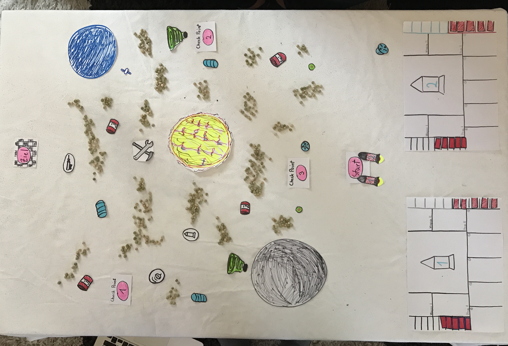

# Spielbeschreibung

## SpaceRush

SpaceRush - Ein Wettrennen im Weltraum. Jeder gegen Jeden. Störe deinen Gegner. Sei smart. Plane gut voraus. Sei unberechenbar. Zerstöre die Schiffe der anderen. Achte auf dein eigenes Schiff. Sei so schnell, wie du nur kannst. Bleibe im Spiel.

Ziel des Spiels ist es, sich gegen den Widerstand des Weltraums und anderer Spieler durchzusetzen und als erster den Zielpunkt zu erreichen.

## Spielbereich

SpaceRush spielt sich im Schwerelosen Weltall ab (keine Reibungskräfte). Der Raum, in dem sich die Schiffe befinden, ist zweidimensional. Im Raum befinden sich Planeten und andere Objekte, die Kraftfelder (Gravitation) ausstrahlen können und mit denen Schiffe kollidieren und interagieren können. 

## Bewegung

Die Schiffe besitzen eine Geschwindigkeit in Form eines Vektors und manövrieren mittels eines Raketenantriebs (Boost). Es gibt einen Hauptantrieb, der das Schiff in die Blickrichtung des Schiffs beschleunigt und Seitenboosts, die das Schiff in eine Richtung (ab)lenken und Reverse Boosts, welche das Schiff abbremsen. In Jeder Runde werden 5 Boostaktionen für das eigene Schiff vorgegeben. Am Rundenbeginn bekommt man 10 Aktionen aus welchen man sich 5 aussuchen kann. Hat man diese Aktionen festgelegt, hat man während der Simulation keinen Einfluss mehr auf seine Schiffe, die tun dann nurnoch das, was man festgelegt hat. Ist das eigene Schiff beschädigt bekommt man am Rundenbeginn entsprechend weniger Aktionen, aus welchen man auswählen kann.

Der Geschwindigkeitsvektor der Schiffe wird durch die Gravitation der im Raum befindlichen Planeten, aber auch durch andere Schiffe oder sonstige Objekte über Anziehungskräfte und Gravitationsfelder manipuliert.

Man hat nur begrenzt Treibstoff zur Verfügung. Am Anfang verfügt man über 5 Einheiten Treibstoff. Unterschiedliche Bewegungen verbrauchen unterschiedlich viel Kraftstoff. Der Kraftstoff lässt sich über ein Power-Up (collectable Item) bis maximal 10 Einheiten erhöhen.

## Interaktionen

### Interaktionen mit anderen Schiffen

Die Schiffe sind mit Waffen ausgestattet, beispielsweise Gravitationsbomben. Außerdem haben sie Kraftfelder, durch welche sie sich gegenseitig von ihrer Flugbahn ablenken können, ohne Schaden zu nehmen.

#### Waffen ####

Waffen müssen **eingesammelt** werden!

Gravitationsmine: Löst bei eintritt in Aktivierungs-Radius der Mine aus. Der Spieler kann entscheiden ob sie wegstößt oder heranzieht. Kann leichte Objekte (Weltraumschrott, Satelieten) verschieben und lenkt das gegnerische Schiff ab.

Raumschiff Gravitations-Welle: Das Raumschiff kann eine Welle auslösen welche Gegenstände und Raumschiffe vom Raumschiff wegschiebt/ablenkt.

EMP-Granate: Die EMP schaltet bestimmte Aktionen des Schiffes aus. z.B. wird der Booster geblockt oder das Schild versagt für einige Zeit.

Laser: Befindet sich beim Auslösen des Lasers ein gegnerisches Raumschiff in einem bestimmten Radius zum eigenen Schiff, wird dieses durch den Laser beschädigt und abgelenkt/abgebremst.

Rakete: Das Raumschiff schießt eine Rakete welche in einem Radius schaden zufügt.

#### Power Ups ####

Schild: Das Raumschiff bekommt einen Schild welcher eine bestimmte Menge an Schaden abblockt. Die maximale Stärke des Schildes beträgt 5. Bei Kollisionen etc. wird das Schild entsprechend geschwächt, bis es bei 0 ist.

Reparatur: Repariert schäden am Schiff. (Füllt Leben auf)

Zusätzlicher Treibstoff: Erhöht die Menge des Treibstoffes für die nächste Runde um 2 Einheiten. (maximales Treibstoffkontingent 10 Einheiten)

### Interaktionen mit Planeten und Objekten

Befinden sich Schiffe in der Nähe von Planeten, werden sie angezogen und in ihrer Flugbahn abgelenkt, rotiert und ggf. verlangsamt. Kommen Schiffe zu nah an Planeten können sie verglühen und werden zu einem Checkpoint zurück gesetzt. Kollidieren Schiffe mit anderen Objekten werden sie ebenfalls abgelenkt und nehmen Schaden oder aber diese Objekte sind sammelbar, dann werden bestimmte Eigenschaften zum Schiff addiert.

### Konsequenzen von Schäden

Bekommt ein Schiff Schaden, hat dies Konsequenzen. Zum einen bekommt man in der nächsten Runde weniger Aktionen, aus welchen man auswählen kann, zum Anderen steigt die Gefahr zerstört zu werden.

Hat man z.B. nur noch 3 Lebenspunkte von 5, so kann man in der nächsten Runde nur noch aus 8 statt 10 Aktionen auswählen.

## Thema Speed

Unser Spiel fasst das Thema "Speed" ganz wörtlich auf. Jedes Schiff (oder Objekt) besitzt einen 2D-Vektor, welcher die Geschwindigkeit des Objektes im 2D-Raum repräsentiert. Die Geschwindigkeit wird während der Simulation immer wieder manipuliert - sei es durch den eigenen Booster, Gravitationen, Kollisionen oder Angriffe anderer Schiffe. Die Geschwindigkeit entscheidet über Sieg oder Niederlage. Man siegt, wenn man als erster das Ziel erreicht, dies hängt alleine von der Geschwindigkeit ab.

# Technische Elemente

## Raum 

2D Physics, aber 3D Objekte, "freie" Bewegung,
Geschwindigkeiten, Positionen und Kräfte werden somit in 2D-Vektoren dargestellt

## View

Top-Down View, man kann auf einen Blick alle Schiffe, Planeten und sonstige Objekte sehen und das gesamte Spielgeschehen mitverfolgen

## Objekte im Raum

- Schiffe

- Planeten, Monde, Sonnen

- schwarze Löcher

- Wurmlöcher

- Weltraumschrott

- Asteroiten, Kometen...

- Raumstationen/Sateliten

- sammelbare Objekte (Items)

### Schiffe-Eigenschaften

Position, Blickrichtung, Lebenspunkte, Schaden, Waffe(n), Boost, Geschwindigkeit, Item(s), Kraftfeld (Radius und Kraft als Vektor)

### Planeten und Monde-Eigenschaften

Radius, Masse (daraus ergibt sich ein Gravitationsfeld), Position,
Lenken Raumschiffe ab, evtl. Beschädigungen

### Sonnen ###

Radius, Masse, Position, hohe Anziehungskraft und Sonnenwinde welche das Schiff schwer beschädigen, ablenken

### Schwarzes Loch ###

Beschädigt das Raumschiff stark. Anschließend wird man (zurückgesetzt zum letzten Checkpoint?)

### Wurmlöcher ###

Schnelle Transportmöglichkeit zwischen zwei festen Punkten. Beschädigt das Schiff leicht.

### Weltraumschrott ###

Beweglicher Schrott im Weltraum welcher Schiffe bei kontakt beschädigt und abbremst. Der Schaden ist Abhängig von der Geschwindigkeit, bei der Kollision.

### Asteroiden ###

Sich bewegende Asteroiden welche von Planeten und Sonnen abgelenkt werden.
Eine Kollision führt zu einer sehr starken Beschädigung und einer starken Ablenkung.

### Raumstationen/Sateliten ###

Besitzen eine Radiusbasierte-Waffe welche den Spieler abschießt und somit Schaden zuführt.

### Sammel-Objekt-Eigenschaften

Alle Power-Ups und Waffen müssen im Raum aufgesammelt werden.

Position, "Sammelradius", wenn gesammelt Zugehörigkeit zu Schiff/Spieler, Addiert Eigenschaften zum Schiff

# Big Idea

Die Idee ist es einen Wettrennen gegen einen anderen Spieler im Weltall zu gewinnen. Daraus ergibt sich ein **schnelles** 2D Spiel. Die Spieler wählen für ihre Runde Aktionen die schließlich in Echtzeit ablaufen. Da alle Aktionen **vorausgewählt** sind, hat man während der Simulation **keinen Einfluss** mehr auf sein Schiff. Beide Spieler versuchen durch **cleveres einsetzen von Umgebung und Items** zu gewinnen. Die Spieler haben begrenzte Zeit und Aktionen zu verfügung und müssen so ihren Weg durch das All bezwingen.

Es kommt also nicht nur auf **Geschick** an, sondern genauso auf **Vorstellungskraft, Ressourcenmanagement** und vor Allem auf eine **gute Strategie**. Man muss versuchen seinen Gegner so gut es geht **einschätzen** zu können. Wohin wird er fliegen? Auf welche Items hat er es abgesehen? Wo platziere ich am Besten meine Minen? Wo löse ich meine on-board Waffen aus? Sammle ich am Besten Items, wie Schilder und Waffen, oder kann ich voll auf Angriff gehen?

Space Rush vereint ein runden-basiertes Spiel mit Geschwindigkeit, Action, Strategie und Geschick. Somit ist die Zielgruppe recht weit gefächert. Fans von runden-basierten Spielen, aber auch von Strategie-Spielen werden dieses Spiel mögen.

# Entwicklungszeitplan

## Funktionales Minimum

**Milestone #01:** Manövrierfähiges Raumschiff (vorerst Steuerung über Tastatur, einfaches GameObject z.B. Sphere)

**Milestone #02:** Gravitationsskript für Planeten, Monde, Raumschiff etc.

**Milestone #03:** Kollision und  Radius-basierte Auslöser (vorerst Konsolenausgabe)

**Milestone #04:** vordefinierte Raumschiffaktionen erstellen und mit dem Raumschiff verknüpfen (ersetzt Tastatur-Steuerung)

**Milestone #05:** Collectables (Grundprinzip und allgemeine Verwaltung) und Checkpoints und End-Checkpoint (Finish) (Prinzip und Verwaltung)

**Milestone #06:** Raumschiff Lebenspunkte und Schild, Treibstoff, Items und Checkpoint Properties und Funktionalität (sammeln)

**Milestone #07:** Erstellen von ersten Planeten (einfache Spheres), Verknüpfung mit Kollision und Raumschiff Lebens, Geschwindigkeit und Checkpoint Properties

**Milestone #08:** 

## Minimalziel

## Ziel

## Wunschziel

## Extras

# Teamaufteilung

### Producer

- Jakob

### Programmierung

- David
- Tjark
- Jakob

### Design

- David
- Tjark
- Jakob

### Game-Art

- Jakob