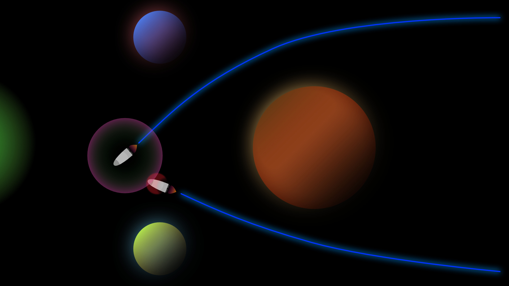

# Spielbeschreibung

## SpaceRush

SpaceRush - Ein Wettrennen im Weltraum. Jeder gegen Jeden. Störe deinen Gegner. Sei smart. Plane gut voraus. Sei unberechenbar. Zerstöre die Schiffe der anderen. Achte auf dein eigenes Schiff. Sei so schnell, wie du nur kannst. Bleibe im Spiel.

Ziel des Spiels ist es, sich gegen den Widerstand des Weltraums und anderer Spieler durchzusetzen und als erster den Zielpunkt zu erreichen.

## Spielbereich

SpaceRush spielt sich im Schwerelosen Weltall ab (keine Reibungskräfte). Der Raum, in dem sich die Schiffe befinden, ist zweidimensional. Im Raum befinden sich Planeten und andere Objekte, die Kraftfelder (Gravitation) ausstrahlen können und mit denen Schiffe kollidieren können. 

## Bewegung

Die Schiffe besitzen eine Geschwindigkeit in Form eines Vektors und manövrieren mittels eines Raketenantriebs (Boost). Es gibt einen Hauptantrieb, der das Schiff in die Blickrichtung des Schiffs beschleunigt und Seitenboosts, die das Schiff in eine Richtung (ab)lenken. Die Boosts werden als Beschleunigungsvektor mit der Zeit und dem Geschwindigkeitsvektor des Schiffes verrechnet, sodass ein neuer Geschwindigkeitsvektor entsteht. In Jeder Runde werden 5 Boostaktionen für das eigene Schiff vorgegeben. z.B. Hauptboost (kurz), Seitenboost rechts (lang), Hauptboost (kurz) etc. Hat man diese Aktionen festgelegt, hat man während der Simulation keinen Einfluss mehr auf seine Schiffe, die tun dann nurnoch das, was man festgelegt hat.

Der Geschwindigkeitsvektor der Schiffe wird durch die Gravitation der im Raum befindlichen Planeten, aber auch durch andere Schiffe oder sonstige Objekte über Anziehungskräfte und Gravitationsfelder manipuliert.

## Interaktionen

### Interaktionen mit anderen Schiffen

Die Schiffe sind mit Waffen ausgestattet, beispielsweise Gravitationsbomben. Außerdem haben sie Kraftfelder, durch welche sie sich gegenseitig von ihrer Flugbahn ablenken können, ohne Schaden zu nehmen.

### Interaktionen mit Planeten und Objekten

Befinden sich Schiffe in der Nähe von Planeten, werden sie angezogen und in ihrer Flugbahn abgelenkt, rotiert und ggf. verlangsamt. Kommen Schiffe zu nah an Planeten können sie verglühen. Kollidieren Schiffe mit anderen Objekten werden sie ebenfalls abgelenkt und nehmen Schaden oder aber diese Objekte sind sammelbar, dann werden bestimmte Eigenschaften zum Schiff addiert.

### Konsequenzen von Schäden

Bekommt ein Schiff Schaden, hat dies Konsequenzen. Zum einen ist das Schiff in der nächsten Runde geschwächt und nicht mehr so leistungsfähig, zum anderen steigt die Gefahr, zerstört zu werden.

Steigt der Schaden weiter, sind ab einer Kritischen Anzahl von Schadenspunkten, bestimmte Bewegungen fest und können nicht mehr geändert werden. Das hat zur Folge, dass defekte, also bereits mit viel Schaden belastete Schiffe nicht mehr uneingeschränkte Bewegungsfreiheit haben und noch angreifbarer sind.

## Thema Speed

Unser Spiel fasst das Thema "Speed" ganz wörtlich auf. Jedes Schiff (oder Objekt) besitzt einen 2D-Vektor, welcher die Geschwindigkeit des Objektes im 2D-Raum repräsentiert. Die Geschwindigkeit wird während der Simulation immer wieder manipuliert - sei es durch den eigenen Booster, Gravitationen, Kollisionen oder Angriffe anderer Schiffe. Die Geschwindigkeit in beide Richtungen ist das entscheidende Element im Spiel, die Geschwindigkeit entscheidet über Sieg oder Niederlage. Man siegt, wenn man als erster das Ziel erreicht, dies hängt alleine von der Geschwindigkeit ab - Hierbei kommt es aber entscheidend auf die Geschwindigkeiten in beide Richtungen an, aus diesen ergibt sich die Richtung und somit, ob man überhaupt im Ziel ankommt und natürlich wie schnell man dort ankommt.

# Technische Elemente

## Raum 

Zweidimensional, "freie" Bewegung,
Geschwindigkeiten, Positionen und Kräfte werden somit in 2D-Vektoren dargestellt

## View

Top-Down View, man kann auf einen Blick alle Schiffe, Planeten und sonstige Objekte sehen und das gesamte Spielgeschehen mitverfolgen

## Objekte im Raum

- Schiffe
- Planeten
- Gegenstände
  - sammelbare Objekte
  - Asteroiten, Kometen...
  - Weltraumschrott
  - Satelliten

### Schiffe-Eigenschaften

Position, Blickrichtung, Lebenspunkte, Schaden, Waffe(n), Boost, Geschwindigkeit, Item(s), Kraftfeld (Radius und Kraft als Vektor)

### Planeten-Eigenschaften

Radius, Masse (daraus ergibt sich ein Gravitationsfeld), Position

### Sammel-Objekt-Eigenschaften

Position, "Sammelradius", wenn gesammelt Zugehörigkeit zu Schiff/Spieler, Addiert Eigenschaften zum Schiff

### Satelliten, Schrott, Asteoriten-Eigenschaften

Position, Größe (Radius), Masse, Schadenswirkung

# Big Idea

# Entwicklungszeitplan

# Teamaufteilung

### Producer

### Programmierung

- David
- Tjark
- Jakob

### Design

### Game-Art

