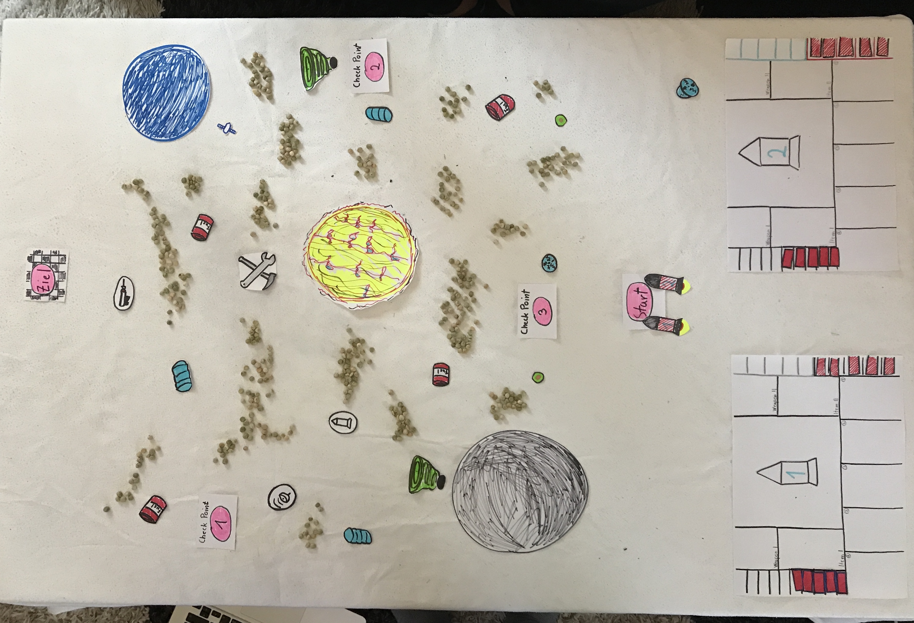

# Prototyp

## Das Hud und Aktionen

Ganz links befindet sich die Anzeige für den verfügbaren Treibstoff (rot). Die Slots am unteren Rand (1-5) dienen den Booster-Aktionen, welche jede Runde neu belegt werden. Am rechten Rand befinden sich die Lebensanzeige (rot gestrichelt) inklusive der Anzeige für die Schildstärke (blau). In der Mitte ist die Ansicht seines Schiffes. Um diese Ansicht herum befinden sich 4 Slots für die aktuell verfügbaren Waffen bzw. Items.

Pro Runde wählt der Spieler 5 Aktionen aus, welche in die jeweiligen Slots gelegt werden.

In der nächsten Runde werden die festgelegten Aktionen dann für jedes Raumschiff gleichzeitig ausgeführt.

Wenn während der Runde Items eingesammelt werden landen diese in den zugehörigen Slots, sind aber erst in der nächsten Runde einsetzbar.

Bei Kollisionen oder Angriffen während der Runde verliert man Leben.

Dies lässt sich verhindern, wenn man ein Schild eingesammelt hat. Somit ist man gegen einige Angriffe geschützt.

Um eine gesammelte Waffe auszulösen zieht man diese in einen Aktionsslot.

Wird der Slot erreicht, löst die Waffe aus. Hier z.B. die Gravitationswelle, welche den Weltraumschrott nach vorne katapultiert/geschoben hat.

## Erfahrungen

Insgesamt war der Prototyp mehr Arbeit als wir gedacht hatten, da wir uns vorher noch keine Gedanken über Anzeigen, Hub sowie Anordnung und Menge der Objekte im Raum gemacht hatten und wir uns dazu noch Konzepte überlegen mussten. Auch das Basteln an sich war einiges an Arbeit und sehr ungewohnt, da man sonst nur Code vor sich hat.

Im Endeffekt finden wir jedoch, dass es sich gelohnt hat, da wir so unser Konzept einmal durchspielen konnten und Schwächen schnell identifizieren konnten.

So haben wir z.B. gemerkt, dass wir wohl mehr Weltraumschrott auf der Map verteilen müssen, als wir dachten, damit es nicht zu einfach ist durchs All zu manövrieren. Somit kann man nicht einfach mit Vollspeed zum Ziel schießen, sondern ist gezwungen sich durch eine Art Labyrinth zu kämpfen.

Wir haben auch gemerkt, dass es wohl sinnvoll ist eine Art Bremse (Reverse Booster) einzubauen, da es sonst mit zunehmender Geschwindigkeit schwieriger wird zu manövrieren.

Auch ist uns aufgefallen das eine lineare Map in der man von A nach B fliegt kompliziert ist und sich wenig lohnt. Daraufhin entwafen wir Checkpoints welche einen Mehrfach über die Map fliegen lassen. Dies führte zu dem gewünschten Ergebniss das die Items und Waffen verwendet werden konnten.

Wir konnten durch kleine Situationen schnell Äderungen vornehmen ohne dabei viel neu zu erarbeiten. Anschließen haben wir das Spiel komplett gespielt und es wurde nach wenigen Änderungen spielbar. Das Spiel hat Spaß gemacht.