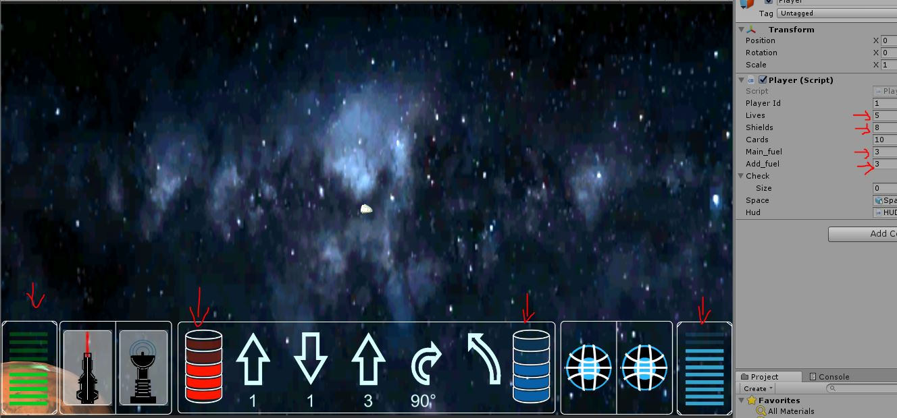

# Projekt-Tagebuch

## 01 Dez 2018 - Spacecraft

## 02 Dez 2018 - Startpoint, Endpoint, Movements, Camera

## 03 Dez 2018 - Planet Rotation

## 04 Dez 2018 - HUD

	Das HUD ist ein UI_Canvas. Es beinhaltet UI_Panels, die im folgenden beschrieben sind.
	Das HUD ist vom Typ <tt>HUD_Canvas</tt>	
	  	
	<i> von: David  
	Beim Erstellen des UI_Canvas wird auch ein EventSystem erzeugt, dessen Einsatz sich 
	mir noch nicht erschlossen hat. Können wir sicher nutzen, um das Canvas mit 
	bestimmten Events zu verknüpfen oder vom GameManager. 
	Habe noch keine Skripte für das HUD erstellt, da ich noch nicht weiß, ob das nicht 
	einfach der GameManager übernehmen kann.</i>

### HUD_Live

	HUD_Live ist von <tt>UI_Panel</tt> abgeleitet.
    Zeigt die aktuellen "Lebenspunkte" des Spielers bzw. seines Raumschiffes an.
    Lebenspunkte haben eine grüne Farbe.
    Beinhaltet Lebenspunkte vom Typ <tt>HUD_Live_Item</tt>.

### HUD_Live_Item

	Jedes Item ist abgeleitet von <tt>UI_Image</tt>. Lebenspunkte haben eine grüne Farbe.

### HUD_Shield

    HUD_Shield ist von <tt>UI_Panel</tt> abgeleitet.
    Zeigt die aktuellen "Schildpunkte" des Spielers bzw. seines Raumschiffes an. 

### HUD_Shield_Item

	Jedes Item ist abgeleitet von <tt>UI_Image</tt>. Schildpunkte haben eine blaue Farbe.

### HUD_Weapons

	HUD_Weapons ist von <tt>UI_Panel</tt> abgeleitet.
	Es gibt zwei Waffen-Slots, die anzeigen, welche Waffen der Spieler momentan 
	ausgerüstet hat. Beinhaltet zwei Elemente vom Typ <tt>HUD_Weapon</tt>.

#### HUD_Weapon

	Waffenkarte, die nach dem Einsammeln "ausgerüstet" bzw. im Waffenslot sichtbar sind.
	Waffen sind vom Typ <tt>UI_Image</tt> abgeleitet.

### HUD_Movements

	Beinhaltet die momentan vom Spieler ausgewählten Bewegungen. 
	Einzelne Bewegungen sind als GameObject vom Typ <tt>HUD_Movement </tt>

#### HUD_Movement

    Zeigt die Bewegung an. Wahlweise kann per Text angezeigt werden,  welche 
    Eigenschaft die Bewegung hat. Z.B. Rotationswinkel, Booststärke etc.

### HUD_Items

	HUD_Items ist von <tt>UI_Panel</tt> abgeleitet.
	Es gibt zwei Item-Slots, die anzeigen, welche Items der Spieler momentan 
	ausgerüstet hat. Beinhaltet zwei Elemente vom Typ <tt>HUD_Item</tt>.

#### HUD_Item

	Itemkarte, die nach dem Einsammeln "ausgerüstet" bzw. im Itemslot sichtbar sind.
	Items im HUD sind vom Typ <tt>UI_Image</tt> abgeleitet.

## 05.12.2018 HUD-Update
### Sprites

	Unter <tt>Assets/Materials/HUD/*</tt> abgelegt.
	Jedes Sprite ist als PNG hinterlegt und wird von Unity als <tt>Sprite (2D and UI)</tt> 
	interpretiert. Die Sprites werden von den jeweiligen Elementen als Image source 
	verwendet und können dort z.B. noch einmal mit anderen Farben gefüllt werden.
		  	
	<i>von: David  
	Beim Erstellen des UI_Canvas wird auch ein EventSystem erzeugt, dessen Einsatz sich 
	mir noch nicht erschlossen hat :). Können wir sicher nutzen, um das Canvas mit 
	bestimmten Events zu verknüpfen oder vom GameManager. Schwierig hierbei war, 
	herauszufinden, dass man die Bilder von Unity als Sprite für UI einlesen lassen muss, 
	sonst wurde nichts dargestellt.</i>

### Erstentwurf

    Erster Entwurf in Szene gespeichert <tt>Assets/Scenes/HUDScene</tt>

   

## 08.12.2018 HUD-Update
### Abstrakte Klasse HUD_Component_Template

	<i>von: David  
	Anlegen der Abstrakten Klasse war etwas friemelig, da ich nicht so den Durchblick in der 
	C# Syntax hatte. Letztendlich aber hat es funktioniert, die Vererbung zu nutzen. 
	  
	Wichtig zu Beachten war, dass die Sprites, welche von den jeweiligen Scripten geladen 
	werden unter <tt>/Assets/Resources/Sprites/</tt> abgelegt werden müssen.
	</i>

	Für die HUD_Components gibt es nun eine Abstrakte Klasse, die als "Template" genutzt 
	werden kann und alle notwendigen Methoden und Variablen vererbt. 
	So kann ein HUD_Component, der Images bzw. Sprites nutzt und bestimmt Werte des 
	Spielers anzeigen soll, leicht erzeugt werden.

	Die Abstrakte Klasse für HUD_Components ist abgelegt unter 
	<tt>Assets/Scripts/HUD/HUD_Component_Template</tt>

	Jedes davon abgeleitete HUD_Component hat folgende Eigenschaften.
	<ul>
		<li>
            <tt>item_list : List<KeyValuePair<int,GameObject>></tt> 
            <i>Liste der enthaltenen Indikatoren (Balken, Punkte etc.) </i>
		</li>
		<li>
			<tt>color_active : Color32</tt>
            <i>Farbe aktiver Elemente (z.B. noch verbleibende Lebenspunkte) </i>
        </li>
		<li>
			<tt>color_inactive : Color32</tt>
            <i>Farbe inaktiver Elemente (z.B. verlorenes Leben) </i>
		</li>
		<li>
			<tt>itemNameClass : String</tt>
            <i>Namens_Präfix der einzelnen Indikatoren, danach folgt noch ein Index, der 
            aber innerhalb des HUD_Component_Templates noch angehängt wird, um 
            jedes einzelne Element addressieren zu können. </i>
		</li>
		<li>
			<tt>maxValue : int</tt>
            <i>Maximalwert der HUD_Komponente (z.B. max. 10 Lebenspunkte)</i>
		</li>
		<li>
			<tt>useSprite : bool</tt>
            <i>Legt fest, ob ein Sprite geladen werden soll, wenn ja, muss spritePath 
            festgelegt werden, sonst gibt es einen Fehler.</i>
		</li>
		<li>
			<tt>spritePath : String</tt>
            <i>Gibt den relativen Pfad unter <tt>Assets/Resources</tt> an, wird ein Sprite 
            geladen, müssen die Sprites 
            unter<tt>Assets/Resources/Sprites/_spritename_</tt> 
            abgelegt werden.</i>
		</li>
	</ul>

### Einbindung in Player_Script

	<i>von: David  
	Habe mich erst einmal gegen ein Event-gesteuertes System entschieden. Das könnten 
	wir später vielleicht einbinden. Stattdessen habe ich die Player-Klasse genutzt, um 
	Updates auf dessen Attribute direkt auf das HUD anzuwenden. Dabei habe ich darauf 
	geachtet, dass das Player_Script nur mit dem HUD_Script bzw. der HUD-Klasse 
	kommuniziert. Die HUD-Klasse stellt momentan einfach public Attribute zur Verfügung, 
	da könnte man sicher noch Setter einbauen und eine gewissen Logik, aber es 
	funktioniert schon sehr gut so.
	</i>

    Im Player.cs Script wird das HUD mittels seines Scripts initialisiert. 
    <tt>hud = GameObject.FindWithTag("HUD").GetComponent<HUD>();</tt> 

    Danach sind die 
    öffentlichen Attribute des HUD im Player_Script nutzbar. Alle von den Werten des Spieles 
    abhängigen Werte können hier über HUD_Variablen verändert werden und erzeugen 
    eine veränderung des HUDs zur Laufzeit.

    Über die HUD_Variablen kann das HUD gesteuert werden, dabei spielt eigentlich nur eine 
    farbliche Kenntzeichnung eine Rolle, bzw. die Anzahl "aktiver" Elemente. Aktiv bedeutet 
    z.B. noch  verfügbarer Lebenspunkt oder nicht verbrauchter Schild etc.  
    <tt> this.hud.live.set_ActiveItemsColor(lives); </tt> 
    <tt> this.hud.main_fuel.set_ActiveItemsColor(this.main_fuel);  </tt>
    <tt> this.hud.add_fuel.set_ActiveItemsColor(this.add_fuel); </tt>
    <tt> this.hud.shield.set_ActiveItemsColor(this.shields);</tt> 

### HUD Screenshots

  

## 09.12.2018 HUD-Update, JSONSerialization, MovementCards

	<i>von: David  
	Die im HUD angezeigeten "Karten", also Bewegungen, Rotationen etc. können jetzt aus 	Dateien geparsed und serialisiert werden. Die einzelnen <tt>MoveCard</tt> Objekte 
	werden in Listen der Klasse <tt>MoveCards</tt> gespeichert.   
	Sobald das Player_Script geladen wird, erhält der Spieler (nur temporär und im Moment) 
	Karten aus diesem Stapel zugewiesen. Später kann er aus einem größeren Stapel von 
	Karte auswählen. Allerdings habe ich diese Funktionalität aus Zeitmangel noch nicht 
	implementiert.
	</i>

### Klasse MoveCards und MoveCard

	Die Klasse <tt>MoveCards</tt> wird als "Kartenstapel" verwendet. Bei erzeugung kann 
	eine beliebige Stapelgröße gewählt werden.

	Die Methode <tt>get_random_Movecards(_anzahl_)</tt> nutzt einen JSON-Parser, um aus 
	einer bereits hinterlegten Liste, einen Stapel zu erzeugen. Momentan ist das ein 
	vorgefertigter Kartenstapel aus 50 Karten verschiedener Bewegungen. Diese "Random" 
	Karten sieht man auch, wenn die Szene gestartet wird. Sie sind jedes Mal anders belegt.

### JSONParser

	Die Klasse <tt>JSONParser</tt> kann derzeit Text-Dateien einlesen und, sofern sie in 
	JSON-Format gespeichert sind, Zeilenweise Objekte daraus erzeugen. Die Klasse ist recht 
	klein und erzeugt derzeit nur Objekte vom Typ <tt>MoveCards</tt> also der 
	Kartenstapel-Klasse.

### HUD_Selected_Movements und HUD_Available_Movements

	Die Klasse <tt>HUD_Selected_Movements</tt> und <tt>HUD_Available_Movements</tt> 
	sind Unterkomponenten des HUD. Sie können Kartenstapel anzeigen. 

	<tt>HUD_Selected_Movements</tt> kann 5 Karten anzeigen, die per Objekt vom Typ 
	<tt>MoveCards</tt> (dem Kartenstapel) übergeben werden.

	<tt>HUD_Selected_Movements</tt> kann derzeit 10 Karten anzeigen, die per Objekt vom 	Typ <tt>MoveCards</tt> (dem Kartenstapel) übergeben werden. Allerdings soll dieser 
	Stapel später, beim Einsammeln von Schildpunkten noch auf bis zu 15 Karten erhöht 
	werden können. So weit sind wir aber noch nicht.

### HUD Screenshots

 

Leere Szene (nicht gestartet)  

 

Sobald die Szene gestartet wird, werden die Daten geladen und das HUD gefüllt.  

	Die Objekt-Daten für die Kartenstapel kommen aus einer vorgefertigten Stapel-Datei

## Layer-Fortschritt

Der Layer 1 ist abgeschlossen, Layer 2 zum Großteil vervollständigt und der Gamemanager aus Layer 3 implementiert.

Die Planeten sowie die dazugehörige Gravitation sind vollständig implementiert.

Das Basic Raumschiff ist implementiert und die Steuerung ist wie in Layer 2 beschrieben. 

Die Checkpoints sind funktionsfähig und es gibt Barriers um die Map. 

Das Hud und ein Eventsystem sind außerdem hinzugefügt. 

Layer 2 ist funktionsfähig es fehlt jedoch der Multiplayer. 

Die Basic Sounds werden gespielt und es gibt Hintergrundmusik. 

Die Bewegung des Schiffes erfolgt über die vorgesehene Steuerung durch Bewegungskarten.

Der in Layer 3 geplante Gamemanager wurde vorgezogen und Implementiert.

### Herausforderungen

Nach der Fertigstellung des ersten Layers ist unser Fokus durch die Notwendigkeit eines Gamemanagers und der dazugehörigen Spieler dahin abgewichen. Den in der Planung in Layer 3 ansässigen Gamemanager  wurde somit in den zweiten Layer verlegt da dieser Vorzeitig benötigt wurde. Durch diesen Vorschub ist es uns möglich geworden die nötigen HUD und Bewegungskarten sofort auf den Gamemanager umzustellen. Dies ermöglicht uns eine finalisierte Implementierung dieser und einer Nutzung des Eventsystems wie in der Planung vorgesehen.

Herausfordernd war die Implementierung der Bewegungskarten und des HUD's. Nach zeitaufwändiger anfänglicher Planung kam es durch unvorhergesehene kleine Probleme zu großer Debugarbeit. Das Großteil des HUD's welches nur von dieser Debugarbeit zurückgehalten wurde verlangsamte die Entwicklung der Bewegungskarten da diese direkt mit dem HUD verwoben sind. Nach diesen Schwierigkeiten kamen wir aber zu einem erfreulichen Fortschritt welcher unser Zwischenbericht berschreibt. Unsere Probleme mit Unity waren kaum nennenswert und wir hatten durch gute Planung wenige Mergeprobleme.