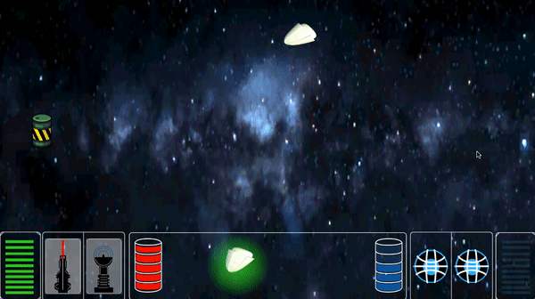
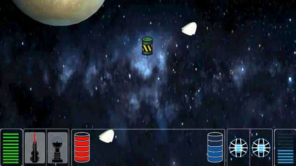

# Alpha Release

Die Projekt-Struktur wurde verbessert, sodass nun alles schön in Ordnern sortiert ist.

## Game-Manager

Der Game-Manager unterstützt nun 2 Spieler.

## Spacecraft

Das Spacecraft und der Spacecraft-Controller wurden dahingegen angepasst, dass man nun nicht nur Bewegungen festlegen kann, sondern auch Waffen. Dies geschieht mit der neuen Methode  `AddAction(SpacecraftAction action)`. Dafür wurde auch eine Wrapper-Klasse geschrieben, welche Bewegungen und Waffen als Aktion zusammenfasst. Der Spacecraft-Controller kann nun wenn eine Waffe gestzt wurde ein Waffen-Prefab initialisieren. Dies wurde momentan nur für die Gravity-Mine umgesetzt.

## Collectables

Um Waffen, mehr Fuel oder Shield zu bekommen, muss man diese Items sammeln (Collectables). Die Funktionalität der Collectables ist nun soweit implementiert. Wenn man ein Collectable im Radius triggert, wird dieses nun dem HUD hinzugefügt, bzw. es wird das Fuel oder Shield aufgefüllt.

## Waffen

Die Gravity-Mine ist in einer Basisform implementiert und als Prefab einsatzbereit. Wenn die Gravity-Mine vom Spacecraft-Controller gesetzt wird läuft ein Countdown ab, danach wird sie aktiv und schleudert Raumschiffe weg, wenn sie den Auslöse-Radius triggern (Sie fügt dem Rigid-Body des Raumschiffs eine Force und Torque hinzu, die Kraft ist einstellbar).

## HUD

Das HUD wurde nun so umgeschrieben, dass es nun auch 2 Spieler unterstützt und man nicht nur Bewegungskarten wählen kann, sondern auch Waffen setzten kann. Das HUD blendet nun vollständig aus, wenn die Simulation abläuft, sodass es jetzt keine Teile der Simulation mehr verdeckt. Außerdem wechselt das HUD nun die Farbe, je nachdem welcher Spieler gerade aufgefordert ist seine nächsten Karten und Waffen zu legen.

## Kamera

Das Camer Script wurde überarbeitet und unterstützt nun auch die Funktion die Spacecrafts zu verfolgen, sodass immer beide Spacecrafts noch zu sehen sind. Es konnte auch ein Bug beseitigt werden, wodurch die Kamera im "Verfolgungs-Modus" ruckelig war.

Die Kamera verfolgt beide Raumschiffe

Das obere Raumschiff setzt eine Gravitations-Mine, welche kurz darauf aktiv wird