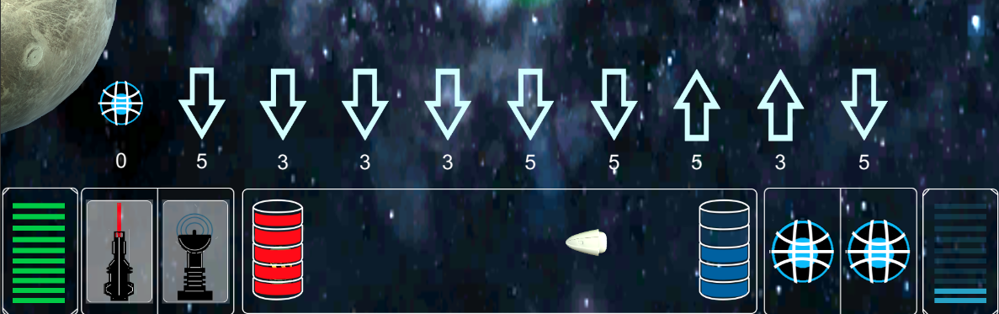

# Playtesting

An unserem Playtesting haben insgesamt 5 Personen teilgenommen. 2 Personen wurden direkt eingeladen und haben auf unseren Rechnern gespielt. Die restlichen Tester haben das Spiel mit Hilfe von Parsec, einem Programm für Gamestreaming mit Eingabe-Unterstützung übers Netzt auf unseren Computern gespielt.

## Teilnehmer

Alle Teilnehmer des Playtestingskamen aus unserem engeren Bekanntenkreis. Es handelte sich größtenteils  um Freunde, aber auch einige Familienmitglieder. Die Tester waren alle zwischen 19 und 24 Jahren. Alle Tester haben gewisse Spielerfahrung, manche mehr, manche eher weniger.

## Fragen und Antworten

### Generelle Fragen

**Wie war der erste Eindruck?**

- Der erste Eindruck war bei fast allen gut. Viele mochten die Spielidee, die Musik kam auch gut an.
  - *"Eine sehr lustige und gute Spielidee"*
  - *"Ist ein nettes kleines Spiel. Mir hat die Musik sehr gefallen."*

**Gab es große Probleme während des Spielens?**

- Während des Spielens kam es zu mehreren Problemen. Es haben z.B. die Boundaries nicht funktioniert, welche das Raumschiff beim triggern eigentlich zum letzten Checkpoint zurück setzten sollte. Beim Setzten von Minen Wurde es teilweise ruckelig, da sich die Minen noch nicht von selbst wieder aus der Szene entfernt haben. Es wurde auch oft angegeben, dass es sehr schwer einzuschätzen sei, wohin das Raumschiff fliegen wird.
  - *"Es ist schwer einzuschätzen wo das Raumschiff hinfliegt und durch die Leichtigkeit des Minen-Spams fingen die Raumschiffe an zu stucken."*
  - *"Die Border hat nicht funktioniert"*

### Formales zum Spiel

**Was ist das Ziel des Spiels?**

- Das Ziel des Spiels war von Anfang an klar.
  - *"Checkpoints erreichen."*

**War das Ziel erreichbar?**

- Beim Erreichen des Ziels gab es deutliche Schwierigkeiten, va. weil man die Flugbahn der Raumschiffe nur schwer vorraussagen kann, bzw. man nur ein zufälliges Karten-Set bekommt und man nicht immer so fliegen kann wie man möchte. Auch hier kam es wieder zu Performance Problemen.
  - *"Nicht wirklich, weil die Flugbahn der Raumschiffe nicht leicht einzuschätzen ist und meine Raumschiffe am Ende stuckten."*
  - *"Fast."*

**Gab es sichtbare Strategien an das Spiel heranzugehen?**

- Alle Tester haben Strategien erkannt.
  - *"Ja, es gab sichtbare Strategien"*

**Hast du Fehler entdeckt? Wenn ja, welche?**

- Es wurden mehrere Fehler entdeckt. Bei vielen der Fehler handelt es sich allerdings um Dinge, welche einfach noch nicht fertig implementiert waren, bzw. vergessen wurden zu implementieren, wie zB. Das Problem, dass explodierte Mienen einfach auf der Map bleiben und nicht destroyed werden

### Suchtfaktor

**Wann war das Spiel langweilig?**

- Oft wurde eine schlechte Auswahl der zur Verfügung stehenden Karten als Langweilig bezeichnet. Auch der übermäßige Einsatz von Waffen war ein Problem für die Tester.
  - *"Als man nur Rückwärts karten bekommen hat"*
  - *"Als das Spielfeld voller Minen war und meine Raumschiffe durch das Rumdrehen sich nicht mehr wirklich bewegen konnte."*

**Wann hat das Spiel am meisten Spaß gemacht?**

- Die Spieler haben die Waffen als ein wesentlichen Teil des Spiels gesehen. Es ist also abzusehen das eine Vielzahl von Waffen von den Testern gewünscht wird.
  - *"Als die Gravity Minen dabei waren"*

### Interface

**Kamst du mit dem Interface zurecht?**

- Das Interface wurde gut angenommen. Die Tester haben das HUD nach erster Erklärung verstanden. Ein kleines Infofenster oder eine kurze Erklärung wäre für die Endversion zu empfehlen.
  - *"Die Tatsache, dass man nicht weiß, was die Balken rechts und links im HUD repräsentieren, verhinderte nicht die Planung der eigenen Flugmanöver. Die Auswahl der Karten erfolgt intuitiv."*
  - *"Erst nach Erläuterung, es fehlen Beschreibungen wie "Schild" und "Leben" im HUD"*

**War die Steuerung angemessen? Wenn nicht, was muss geändert werden?**

- Das große Manko unseres Spiels. Die Tester waren sich einig das die jetzige Steuerung nicht für das Endprodukt reicht. Vorgeschlagen wurden eine "Simulation" (Vorschau) des zu fliegenden Manövers oder eine andere Steuerungsart. Auch die Steuerung der Kamera wurde bemängelt.
  - *"Steuerung ist einfach , nur hat man keine wirkliche Vorstellung , wo das Raumschiff nun wirklich hinfliegt".*
  - *"Nein, sie war schrecklich."*
  - *"Die Bewegung der Kameraperspektive ist umständlich. Besser wäre es, die Kameraführung vollständig über die Maus steuern zu können. (Also sowohl Zoomfunktion als auch Bewegen des Sichtfelds.)"*

**Wie kamst du mit den Regeln zurecht?**

- Die Regeln des Spiels waren nach einer Einführung leicht verständlich. Für das Endprodukt ist eine Hilfeseite oder ein Tutorial zu empfehlen.
  - *"Die Regeln des Spiels wurden zu keinem Punkt eingeführt. (Die Regeln an sich sind leicht verständlich, WENN sie einem denn erklärt werden.)"*
  - *"Sehr gut , weil es kaum Einschränkungen gab."*
  - *"Ja, ich kam mit den Regeln zurecht"*

### Fazit

**Wie hat die die Atmosphäre des Spiels gefallen?**

- Die Tester haben die Atmosphäre des Spiels als *"sehr hübsch und passend"* empfunden. Die Musik wurde als Hauptaspekt dieses empfinden gewählt.
  - *"Gut , weil die Karte durch die 3d Planeten sehr hübsch aussieht und die Musik passend gewählt wurde."*
  - *"War recht angenehm, die Musik war klasse."*
  - *"Sie war gut, kann aber mehr Spannung aufbauen."*

**Welche Personen wären deiner Meinung nach die Zielgruppe dieses Spiels?**

- Als Zielgruppe wurde Menschen gewählt welche gerne Strategiespiele spielen.
  - *"Leute die gerne Strategie Spiele spielen"*
  - *"Personen, die gerne strategische Spiele spielen. Ab 16+"*
  - *"Jugendlich und Erwachsene im Alter von 14+ die Spaß an Strategie haben."*

**Würdest du dich zur Zielgruppe zählen?**

- Da die Tester aus den unterschiedlichsten Bekanntenkreisen kamen, hatten wir eine ausgeglichene Menge an Personen aus der Zielgruppe.
  - *"60% Nein"*
  - *"40% Ja"*

**Wenn du eine Sache ändern könntest, welche wäre es?**

- Die Tester haben unterschiedliche schon vorher angesprochene Probleme angesprochen. Wie zuvor genannt war dies Hauptsächlich die Steuerung.
  - *"eine kleine Minimap hinzufügen"*
  - *"Eine voraussichtliche Flugbahn für die Raumschiffe einfügen , um besser manövrieren zu können."*
  - *"Steuerung !!!!!!!!"*
  - *"Die Kameraführung während der Flugmanöver."*
  - *"Schönerer Hintergrund"*

## Erkenntnisse

Als größte Erkenntnis war das die Steuerung als riesen Problem gesehen wurde. Die jetzige Steuerung muss wohl umgestellt werden, wir haben aber schon einige Ideen wie dies geschehen kann. 

Eine gute Erkenntnis war, das den Testern die Waffen gefallen hatten. Uns wurde mehrfach versichert, dass sie viel zum Spiel hinzufügen.

Auch das die Kamera Steuerung angepasst werden sollte ist uns bei unseren Tests nicht als Schwierigkeit aufgefallen, aber eine sinnige Änderung. 

Auch interessant war das die Spieler gerne eine kleine Einführung in das Spiel haben möchten, im besten Falle als eine kleine Hilfeseite.

## Geplante Änderungen

Die wichtigste Änderung ist die der Steuerung. Wie bereits in den Erkenntnissen genannt haben wir schon Ideen. Die jetzt schon umgesetzte ist die, das die Spieler alle Karten zu Verfügung haben und sie diese immer Nutzen können. 

Die anderen Waffen sind schon in Arbeit und sie werden in kürze hinzugefügt.

Die kleine Hilfsseite, sowie die Kamerasteuerungsänderung wurden in die Planung mit aufgenommen.

Eine schlechte Zufalssauswahl der Bewegungskarten macht ein sinnvolles Manövrieren des raumschiffs unmöglich