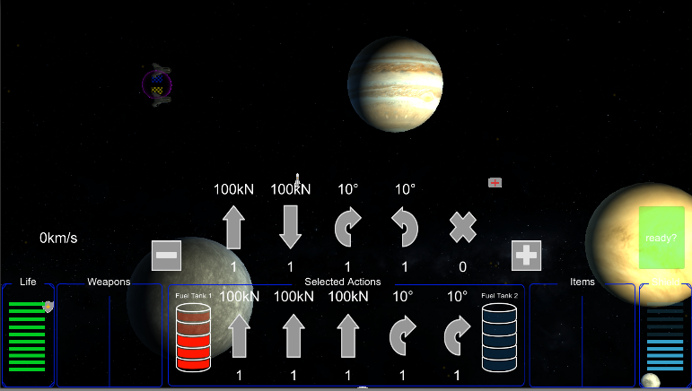
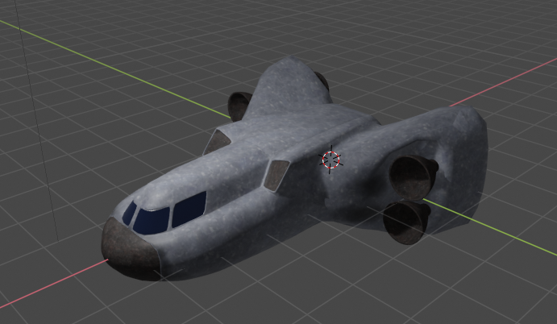
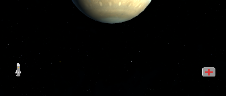
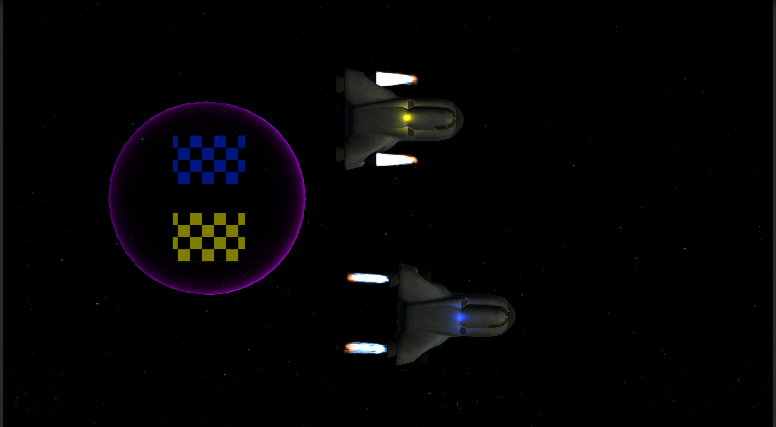

# Final Release

## Änderungen nach Alpha Release

Kamera-Bewegungen und Verhalten wurde überarbeitet und verbessert.

Im Hauptmenü kann man sich auf Wunsch die Spielregeln und Erklärungen der einzelnen Spiel-Elemente anschauen. 

Die Geschwindigkeit des Raumschiffs wird während des Spiels angezeigt.

Waffen und Collectables sind jetzt vollständig im Spiel verfügbar. 

Der Kartenstapel ist durch permanente Aktions-Freiheit ersetzt worden und nicht mehr an den Zufall geknüpft. Einzige Einschränkungen sind Boost und Leben. Die Spacecraft Avatare wurden ersetzt und besitzen einzeln animierbare Boosts. 

HUD und Menü-Elemente haben nun homogene Styles. Die Raumschiffe können den Spielbereich nicht mehr verlassen. 

## Spielidee und Zeitplan

Die grundlegende Spielidee eines rundenbasierten Multiplayer Wettrennens im Weltall ist erhalten geblieben und konnte umgesetzt werden. Das Thema "Speed" spielt in diesem Zusammenhang eine große Rolle, denn die Geschwindigkeit der Raumschiffe ist von entscheidender Bedeutung für die Planung der Spieler-Aktionen. Dabei geht es um das Kalkulieren und einhalten der Positionen, Vektoren und Gravitation.

Im großen und Ganzen konnte der Zeitplan eingehalten werden. Bis auf wenige Ausnahmen konnten fast alle festgelegten Features und Ziele erreicht werden. 

Einige Änderungen sind während der Projekt-Durchführung verworfen oder stark verändert worden. Bis auf das "Wurmloch" haben jedoch alle Features ihren Weg in das Spiel gefunden.

## Entwicklungszeitplan, Prototyp und Playtesting

Der Entwirklungszeitplan war eine großen Hilfe beim Planen und Durchführen der einzelnen Projekt-Schritte. Er hat einen Rahmen abgesteckt, an dem man sich zu jederzeit orientieren konnte. Die Reihenfolge der Features war bis auf einige Ausnahmen, wie das Event-System oder den GameManager oft gut gewählt und konnte während der Projekt-Durchführung chronoligisch abgearbeitet werden.

Das Final Release bzw. Alpha Release weißt im Vergleich zum Prototypen einige Grundlegende Änderungen auf. 

### Prototyp
beinhaltet Waffen- und Item-Platzhalter, Spacecraft ist nur ein einfaches Sprite. Checkpoints sind einfache Point-Light-Objekte, die Skybox ist schlecht aufgelöst. Es gibt kein Pause-Menü oder eine Möglichkeit das Spiel zu beenden oder neu zu starten. Es gibt kein Hauptmenü. Die Steuerung mit Karten war erst sehr spät im Spiel möglich. Die Karten-Auswahl ist Zufallsbasiert und funktioniert oft nicht, weil die Karten nicht gut durchmischt sind bzw. nicht "gebalanced".

### Unterschiede zur Final-Version:

Die Karten-Auswahl ist nun nicht mehr Zufalls-Basierend aufgebaut sondern erfordert mehr Resourcen-Management. Die Intensität der einzelnen Bewewegungen lässt sich duch Buttons skalieren und es müssen nicht länger 5 Aktionen definiert werden. Es können bis zu 5 ausgewählt werden, aber der Spieler kann Aktionskarten überspringen.

In der Finalen Version des Spiels sind die Spacecrafts überarbeitet. Wir haben in Blender eigene Modelle gemodelt und texturiert. Die Planeten haben HD-Texturen, die sich stark voneinander unterscheiden. Außerdem ist das directional-Light verändert worden und die Skybox ist ein hochauflösender Weltraum, der durch ein diffuses Flimmern an den echten Weltraum erinnert. 

Items und Waffen sind keine Platzhalter mehr, sondern Collectable Items in der Spielwelt. 

Die SpaceCrafts und ihre Booster zeigen durch ihre Animation genau an, welche Bewegungen gerade durchlaufen werden. Außerdem sind sie farblich voneinander unterscheidbar und das HUD passt sich auch an die jeweilige Spieler-Farbe an.

Leider konnten wir aus Zeitgründen nicht alle Waffen umsetzten, die wir uns vorgenommen hatten (Laser).

Auch der Weltraumschrott wurde nicht umgesetzt, da die Steuerung über die Bewegungskarten recht anspruchsvoll ist, wenn man keine Übung hat und man dann nur schlecht durch Schrottfelder hätte manövrieren können.

## Erwartungen

Unsere Grunderwartung an unser Spiel waren ein spielbares Spiel, welches Spaß macht, aber auch anspruchsvoll ist. Unserer Meinung nach haben wir diese Erwartung erfüllt.  Kleinere Rückschläge haben wir durch einen Workaround oft lösen können. Der größte Rückschlag war die anfangs sehr holprige und extrem schwierige Steuerung über Zufallskarten, welche wir über frei wählbare Bewegungen ersetzt haben. Da unsere Spiel aber immernoch der Grundidee entspricht sind wir dennoch zufrieden und stolz auf unsere Arbeit.

## Zeit-Management

Die Zeit war selten ein großes Problem. Die interne Zeiteinteilung war jedoch öfter abweichend von unserem Ziel. Auch die Aufteilung der Aufgaben (Workload/Arbeitszeit) waren nicht immer gerecht verteilt. Bei zukünftigen Projekten wäre es wichtig das Workload besser zu verteilen - unter den Gruppen Mitgliedern und allgemein. Wir hatten zwar Milestones, die wir auch meistens erreicht haben, jedoch gäbe es Verbesserungbedarf bei der Planung der einzelnen Sprints.

## Technische Schwierigkeiten

Technische Schwierigkeiten in Unity gab es kaum. Verständnisprobleme in Unity konnten immer mit Hilfe von Google gelöst werden. Probleme in Git konnten größtenteils vermieden werden, da wir für größere Features immer gebranched haben.

## Thema "Speed"

Ein Thema bei einer sehr offenen Arbeit zu setzen ist eine gute Idee, da sie uns zu einer zielgerichteten Arbeit mit einem Konzept führt. Jedoch gefiel uns das Thema Speed nicht so gut. Dies liegt jedoch wohl eher an dem einzelnen Thema nicht an dem Konzept der thematischen Arbeit. Das Thema "Speed" kann unserer Meinung nach extrem breit interpretiert werden, da alle Spiele irgendwo in Kontakt mit Geschwindigkeit in Form von Bewegungen oder Zeitdruck kommen.

## Was würden wir beim nächsten Mal anders machen?

Eine geregelte durch Wochensprints geteilte Arbeitsweis würde sicherlich helfen. Dadurch wäre der regelmäßige Fortschritt aller beteiligten sichtbar und es wäre leichter frühzeitig auf ausfallende Arbeit zu reagieren. Auch eine kleine Testphase mit Bekannten bzw. wöchentliche interne Tests wären eine willkommene Hilfe um schnell auf grundlegende Probleme hingewiesen zu werden. Auch eine wöchentliche Review mit den Fortschritten, erreichten Milestones, Problemen und offenen Fragen wäre für das nächste Projekt eine große Hilfe.

## Projekt-Erfolg

Im Großen und Ganzen ist unser Projekt ein Erfolg. Wir haben ein fertiges Spiel entwickelt und dabei den Entwicklungszyklus kennen gelernt. Dieser kleine Einblick in ein komplexen Prozess ist für uns eine lehrreiche Erfahrung gewesen und ermöglichte uns diesen besser zu verstehen. Wir konnten unsere Programmierkenntnisse ausbauen und auch gelerntes praktisch anwenden (z.B. Software Patterns). Die gesamte Arbeit am Spiel hat sehr viel Spaß gemacht, war aber gleichzeitig auch fordernd - eine gute Mischung. Einer unserer größten Erfolge jedoch war die grundlegende akzeptanz bei unseren Playtestern. Die ehrliche Rückmeldung und die angenehme Atmosphäre bei den Playtestings waren eine schöne abwechslung vom sonstigen Programmieralltag.

## Verbesserungs-Vorschläge

Im Allgemeinen fanden wir den Aufbau des Kurses sehr gut und strukturiert. Der Vorlesungsteil war sehr interessant und man hat einen guten Einblick bekommen, wie eine Game-Engine funktioniert. In den Übungen konnte man jede Zeit fragen stellen und bekam immer hilfreiche Antworten und konstruktives Feedback bei den Reviews. Auch der Zeitplan war gut abgesteckt. Der Kurs hat uns wirklich großen Spaß gemacht, aber auch sehr gefordert. Da wir sehr zufrieden mit dem Kurs sind, haben wir keine Verbesserungsvorschläge (keine Schleimerei ;) ).

## Unity Engine

Dieses Projekt war unser erstes mit Unity. Die gut strukturierte Entwicklungsumgebung bat durch ihre Einfachheit/Übersichtlichkeit (Drag and Drop, Inspektor) und viele Tutorials einen guten Einstieg in das Entwickeln von Spielen. Auch die dazugehörige Programmiersprache ist aufgrund derÄhnlichkeit zu Java leicht zu erlernen und z.B im Gegensatz zu Unreal von vielen besser zu verstehen. Uns hat auch die große Anzahl von Beiträgen in Foren zu spezifischen Fragen erfreut. Oft waren unsere spezifischen fragen schon online in Foren zu finden. Dies ermöglichte oft das sonst mühsame finden von Struckturfehlern in einem sonst neuen System.